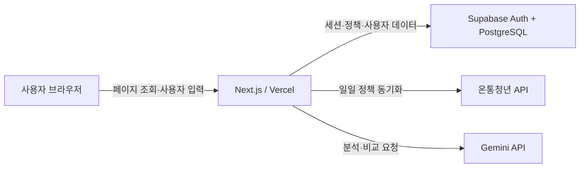
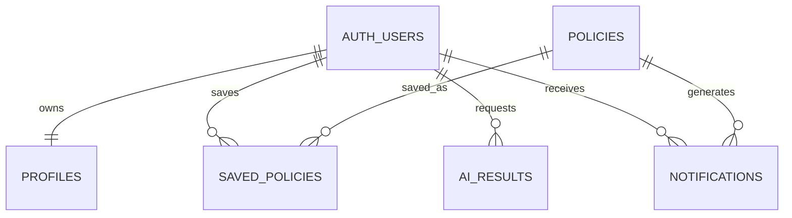
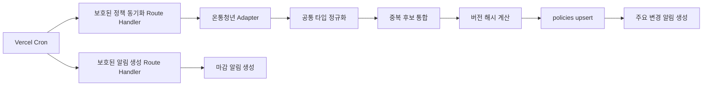
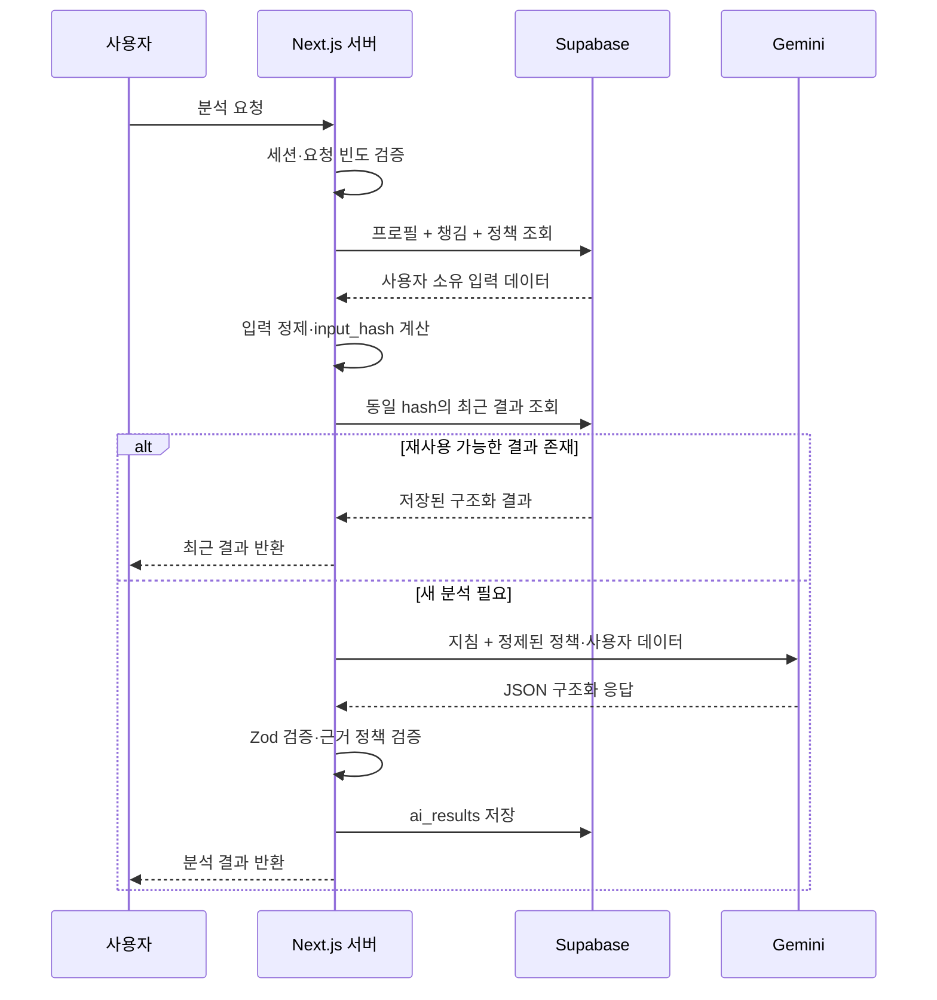

# 챙김 MVP 아키텍처

> 최종 갱신: 2026-08-09
> 기준 문서: [`PLAN.md`](./PLAN.md)
> 범위: 주요 도메인, 페이지 구조, 데이터 모델, 실행 책임, 외부 API 및 AI 데이터 흐름

## 1. 전체 구조

챙김은 Next.js App Router 기반의 반응형 웹 애플리케이션이다. 공개 정책 탐색은 로그인 없이 제공하고, 챙기기·상태 관리·AI·알림 기능은 Google 로그인 사용자에게 제공한다.



핵심 원칙:

- 브라우저는 외부 공공 API와 Gemini를 직접 호출하지 않는다.
- Supabase 서비스 역할 키와 모든 외부 API 키는 서버에서만 사용한다.
- 공개 정책과 사용자 데이터의 접근 통제는 Supabase RLS를 마지막 방어선으로 사용한다.
- 운영용 데이터 모델을 별도로 만들지 않고 Vercel·Supabase 로그를 활용한다.
- 외부 정책 원본 전체는 저장하지 않고 정규화된 정책과 출처 참조만 보존한다.
- 온통청년 정책 동기화는 `https://www.youthcenter.go.kr/go/ythip/getPlcy`에 `apiKeyNm`, `pageNum`, `pageSize`, `rtnType=json`을 사용하고 마지막 페이지까지 순회한다.

## 2. 주요 도메인

### 인증과 사용자

책임:

- Supabase Auth를 통한 Google OAuth 로그인
- 로그인 이전 경로 복귀
- 출생연도, 거주지역, 취업·재학 상태 관리
- 웹 알림 생성과 읽음 상태 관리
- 회원 탈퇴 및 사용자 데이터 연쇄 삭제

경계:

- 인증 신원은 `auth.users`가 관리한다.
- 애플리케이션 프로필만 `profiles`에 저장한다.
- 자격 판정을 위한 상세 소득·가구 정보는 수집하지 않는다.

### 정책 카탈로그

책임:

- 온통청년 정책의 공통 형식 제공
- 키워드, 카테고리, 지역 검색
- 신청 가능 정책의 마감 임박순 정렬
- 정책 상세와 공식 신청처 제공
- 출처와 마지막 동기화 시각 표시

경계:

- 외부 API 응답은 동기화 과정에서만 사용한다.
- 클라이언트 조회는 항상 내부 `policies`를 기준으로 한다.
- 마감 또는 외부에서 사라진 정책은 `inactive`/`archived` 처리하고 즉시 물리 삭제하지 않는다.

### 내 챙김과 신청 관리

책임:

- 정책 챙기기·삭제
- 관심, 확인 중, 신청 예정, 신청 완료, 결과 기록 상태 관리
- 높음·보통·낮음 우선순위와 개인 메모
- 선정·탈락·대기·취소 결과와 결과일·메모 기록
- 공식 신청처 이동

경계:

- 신청 대행이나 기관 시스템 연동은 하지 않는다.
- 신청 상태와 결과는 `saved_policies` 한 행에서 관리한다.

### AI 분석과 비교

책임:

- 저장 정책 전체를 기준으로 현재 챙김 분석
- 선택한 2~3개 정책 비교
- 먼저 확인할 정책, 마감 임박, 확인 필요 조건과 이유 제공
- 프로필 지역과 정책 지역이 맞지 않는 저장 정책의 지역 조건 재확인 안내
- 최근 결과 저장과 입력 변경 여부 판단

경계:

- 정책 추천 챗봇이 아니라 사용자가 챙긴 정책의 정리 도구다.
- 자격이나 수급 가능성을 확정하지 않는다.
- Gemini 응답은 구조화 스키마 검증을 통과한 경우에만 저장한다.

### 알림

책임:

- 헤더 알림함과 읽음 상태
- 마감 7일 전·1일 전 웹 알림
- 저장 정책의 주요 정보 변경 알림
- 동일 이벤트의 중복 생성 방지

경계:

- 브라우저 푸시는 제공하지 않는다.
- 웹 알림과 읽음 상태를 `notifications` 한 테이블에서 관리한다.

### 정책 동기화

책임:

- 온통청년 API 호출
- 응답을 공통 정책 타입으로 변환
- 외부 ID 기준으로 기존 정책을 갱신
- 정책 upsert, 비활성화, 버전 해시 갱신
- 저장 정책의 주요 변경에 대한 알림 생성

경계:

- 별도 관리자 화면, 원본 payload 테이블, 동기화 이력 테이블은 만들지 않는다.
- 실패와 처리 건수는 구조화된 서버 로그로 남긴다.

## 3. 페이지 구조

```text
/
├── policies/[id]
├── login
├── auth/callback
├── my
│   ├── analysis
│   └── compare
├── notifications
├── settings
└── design-system
```

| 경로 | 접근 | 주요 책임 |
|---|---|---|
| `/` | 공개 | 서비스 가치·이용 흐름 소개, 정책 검색, 카테고리·지역 필터, 정렬, 페이지네이션 |
| `/policies/[id]` | 공개 | 정책 상세, 출처, 신청 링크, 챙기기 |
| `/login` | 공개 | Google 로그인 시작, `next` 복귀 경로 유지 |
| `/auth/callback` | 공개 콜백 | OAuth 코드 교환, 세션 생성, 안전한 내부 경로로 복귀 |
| `/my` | 로그인 | 내 챙김 목록, 상태·우선순위·메모·결과 관리 |
| `/my/analysis` | 로그인 | 최근 챙김 분석 조회, 오래됨 표시, 재분석 |
| `/my/compare` | 로그인 | 챙긴 정책 2~3개 선택, 최근 비교, 재비교 |
| `/notifications` | 로그인 | 웹 알림 목록, 개별·전체 읽음 처리 |
| `/settings` | 로그인 | 최소 프로필, 회원 탈퇴 |
| `/design-system` | 내부 정적 문서 | 로고, 색상, 타이포, 아이콘과 제품 UI 적용 예시 |

페이지 구성 원칙:

- 홈은 별도 홍보 경로를 만들지 않고 소개 영역에서 같은 페이지의 정책 탐색 영역으로 바로 연결한다.
- 목록·상세·설정의 최초 데이터 조회는 Server Component에서 수행한다.
- 검색·필터 상태는 URL query string을 기준으로 공유·새로고침 가능하게 유지한다.
- 모달, 선택, 즉시 상태 변경처럼 상호작용이 필요한 부분만 Client Component로 분리한다.
- 정책 목록에서 상세 링크를 열 때는 루트 `@modal` parallel route의 intercepting route가 상세 화면을 모달로 렌더링하고, 직접 `/policies/[id]`에 접근하면 독립 상세 페이지를 렌더링한다.
- 로그인이 필요한 페이지는 서버에서 세션을 검사하고 `/login?next=...`로 이동한다.
- 비회원이 챙기기를 누르면 로그인 후 원래 정책에서 챙기기를 이어갈 수 있게 한다.

### 브랜드와 UI 기반

- 브랜드와 UI 규칙의 단일 기준은 `docs/DESIGN-SYSTEM.md`다.
- Tailwind CSS와 shadcn/ui는 `src/app/globals.css`의 `background`, `foreground`, `primary`, `accent`, `muted`, `border`, `destructive`, `ring` 의미 토큰을 공통으로 사용한다.
- 기본 서체는 npm 패키지로 자체 번들링한 Pretendard Variable이며 외부 폰트 CDN에 의존하지 않는다.
- 브랜드 로고는 `BrandLogo`의 `default | compact`, `brand | monochrome` 공개 변형을 사용하고, 제품 아이콘은 2px 라운드 스트로크의 Lucide 아이콘을 기본으로 한다.
- 홈과 내 챙김의 정책 요약은 `PolicySummaryCard`를 공유한다. 상단은 카테고리·정책명·한국 시간 기준 마감 상태와 북마크 액션, 하단은 분야·지원 내용·정확한 마감일을 표시하며 MVP의 고정 대상 정보는 반복하지 않는다.
- 내 챙김의 상태·우선순위·메모·결과 수정 폼은 정책 카드의 접힌 `details` 영역에서 필요할 때 펼친다.
- `/design-system`은 인증·DB·API 호출이 없는 정적 Server Component이며 내비게이션에서 숨기고 `noindex`로 유지한다.
- MVP는 라이트 모드만 지원한다. 다크 모드와 전체 공용 컴포넌트 세트는 실제 제품 화면 요구가 생길 때 확장한다.

## 4. 데이터 모델

Supabase 관리 테이블인 `auth.users` 외에 애플리케이션 테이블은 5개만 사용한다.



### `profiles`

- `id`: `auth.users.id` PK/FK
- `birth_year`, `region_code`, `employment_status`
- `notification_email`, `notification_email_verified_at`, `email_opt_in`
- `created_at`, `updated_at`

OAuth 가입 시 자동 생성한다. 사용자는 자신의 프로필만 읽고 허용된 필드만 수정한다. 이메일 관련 필드는 선행 스키마와의 호환을 위해 남아 있지만 이번 MVP에서는 사용하지 않는다.

### `policies`

- 정책 내용: `title`, `summary`, `support_content`, `eligibility`
- 신청 정보: 시작일, 종료일, 원문 기간, 상시 여부, 방법, 공식 URL
- 기관 정보: `organization_name`, `contact`
- 탐색 정보: `category`, `region_codes text[]`, `lifecycle_status`
- 출처 정보: `sources text[]` (`youth_center`만 사용), `source_refs jsonb`
- 동기화 정보: `version_hash`, `last_synced_at`
- 공통 시각: `created_at`, `updated_at`

`source_refs`에는 출처, 외부 ID, 원문 URL만 저장한다. 원본 payload는 저장하지 않는다. 활성 정책은 비회원에게도 공개하고, 비활성 정책은 기존에 챙긴 사용자에게만 보여준다.

### `saved_policies`

- 복합 PK: `user_id`, `policy_id`
- 관리: `status`, `priority`, `memo`
- 결과: `outcome`, `result_date`, `result_memo`
- 공통 시각: `created_at`, `updated_at`

사용자는 자신의 행만 생성·조회·수정·삭제할 수 있다. 별도 신청 결과 테이블을 사용하지 않는다.

### `ai_results`

- `id`, `user_id`, `result_type`
- `policy_ids uuid[]`
- `input_hash`, `model_name`, `result jsonb`
- `created_at`

분석은 정책 1개 이상, 비교는 정확히 2~3개를 대상으로 한다. `input_hash`와 현재 입력 해시를 비교해 결과가 오래됐는지 판단하며 별도 무효화 트리거는 사용하지 않는다.

### `notifications`

- `id`, `user_id`, `policy_id`, `type`
- `event_key`, `title`, `body`, `reference_date`, `read_at`
- `email_status`, `email_sent_at`, `email_error`
- `created_at`

`(user_id, event_key)` 유일 제약으로 웹 알림 생성의 멱등성을 보장한다. 이메일 발송과 별도 이메일 이력은 이번 MVP 범위에 포함하지 않는다.

## 5. 서버와 클라이언트 책임

| 영역 | 서버 | 클라이언트 |
|---|---|---|
| 인증 | OAuth 코드 교환, 세션 검증·갱신, 보호 경로 검사 | Google 로그인 시작, 로그인 상태 UI |
| 정책 조회 | 검색 조건 검증, DB 조회, 공개 범위 적용 | 검색어·필터·정렬 입력, URL 상태 관리 |
| 챙김 | 사용자 확인, 정책 존재 확인, 변경 저장 | 상태·우선순위·메모·결과 입력과 낙관적 UI |
| 프로필 | 입력 검증, 탈퇴 처리 | 프로필 폼 |
| AI | 입력 조회·정제, 해시 계산, Gemini 호출, Zod 검증·저장 | 대상 선택, 실행 요청, 로딩·오류·결과 표시 |
| 알림 | 이벤트 생성, 중복 방지, 상태 저장 | 알림 목록, 읽음 요청, 마감 배지 표시 |
| 동기화 | 외부 API 호출, 정규화, 통합, upsert, 변경 감지 | 책임 없음 |

서버 전용 요소:

- Supabase `service_role` 키
- 온통청년 인증키
- Gemini API 키
- Vercel Cron secret
- 외부 API 어댑터와 정규화·중복 통합 로직

클라이언트 허용 범위:

- 공개 Supabase URL과 publishable key
- RLS가 적용된 공개 정책 읽기
- 로그인 사용자의 프로필·챙김·알림 읽음 상태 변경
- 서버 Action 또는 Route Handler를 통한 AI·탈퇴 요청

## 6. 외부 API 연동 위치

외부 API 연동은 Next.js 서버 영역에만 둔다.

권장 모듈 경계:

```text
src/server/policies/
├── adapters/
│   ├── youth-center.ts
├── normalize.ts
├── deduplicate.ts
├── sync.ts
└── types.ts

src/app/api/cron/
├── policies/route.ts
└── notifications/route.ts
```

동기화 흐름:



연동 규칙:

- 온통청년의 모든 페이지 수집이 성공한 뒤에만 정책별 정규화와 upsert를 시작하며, 페이지 요청이 실패하면 기존 정책 데이터를 유지한다.
- 목록·상세·지원조건처럼 분리된 응답은 어댑터 내부에서 결합한다.
- 외부 필드명과 코드 체계는 어댑터 밖으로 노출하지 않는다.
- 외부 ID가 같은 정책은 갱신하고 다른 ID는 별도 정책으로 유지한다.
- 처리 건수와 오류는 구조화된 Vercel 로그로 남긴다.
- Cron 요청은 secret을 검증하고 재실행해도 같은 결과가 되도록 upsert한다.

## 7. AI 기능의 데이터 흐름

### 내 챙김 분석



분석 입력:

- 최소 프로필: 출생연도, 지역, 취업·재학 상태
- 챙김 정보: 상태, 우선순위, 메모
- 정책 정보: 지원 내용, 조건, 기간, 기관, 공식 출처

분석 출력:

- 서버가 계산한 정확한 마감일, 지원 내용, 조건과 신청 행동
- 우선순위·마감 기준 오늘의 확인 순서
- 최소 프로필 기준 확인된 조건, 확인 필요 조건, 불일치 가능성
- 정책별 구체적인 다음 행동과 이유

### 정책 비교

분석 흐름과 같은 파이프라인을 사용하되 서버에서 다음을 추가 검증한다.

- 정책 ID가 정확히 2~3개인지 확인한다.
- 모든 정책이 현재 사용자의 `saved_policies`에 있는지 확인한다.
- 중복 ID를 제거한 뒤에도 2~3개인지 확인한다.
- 지원 내용, 조건, 기간, 신청 방법, 담당 기관은 DB 원문으로 모든 정책의 셀을 채운다.
- 원문에 값이 없으면 `원문에 정보 없음`으로 표시하고 AI가 값을 추정하지 못하게 한다.
- Gemini 출력에 주요 차이, 정책별 장점·주의점과 우선 확인 정책이 모두 있는지 검증한다.

### AI 안전 규칙

- 사용자 메모와 정책 문구는 프롬프트 명령이 아닌 인용 데이터 영역으로 전달한다.
- Gemini에는 DB 식별자, 비밀키, 이메일 등 불필요한 개인정보를 보내지 않는다.
- 정책 원문에 없는 내용을 사실처럼 확정하지 못하게 한다.
- 자격 판단은 `확인 필요`로 표현하고 공식 기관 확인 링크를 함께 제공한다.
- 응답이 JSON 스키마 또는 비즈니스 규칙을 통과하지 못하면 저장하지 않는다.
- Gemini 장애 시 기존 결과가 있으면 생성 시각과 오래됨 상태를 표시해 조회만 허용한다.

## 8. 현재 결정 사항

- 로그인은 Google OAuth만 지원한다.
- 공공 정책 데이터는 매일 한 번 동기화한다.
- 외부 API 원본 payload와 운영 이력은 DB에 저장하지 않는다.
- 앱 테이블은 `profiles`, `policies`, `saved_policies`, `ai_results`, `notifications`만 사용한다.
- AI는 `gemini-3.5-flash-lite`를 서버에서 호출한다.
- 이메일 알림과 Resend 연동은 후속 범위로 미루고, MVP에서는 웹 알림만 생성한다.
- 모바일과 데스크톱을 동일 비중으로 지원한다.
- 관리자 화면, 행동 분석, 브라우저 푸시, 서비스 내 신청은 MVP에서 제외한다.
