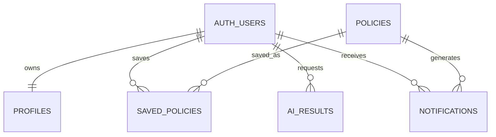

# 챙김 Supabase PostgreSQL 데이터 모델

> 최종 갱신: 2026-08-09
> 기준 문서: [`ARCHITECTURE.md`](./ARCHITECTURE.md)
> 상태: 설계 확정 / 기본 스키마 원격 적용 완료 / 단일 출처 정리 마이그레이션 원격 적용 미확인

챙김 MVP는 Supabase가 관리하는 `auth.users` 외에 애플리케이션 테이블을 5개만 사용한다. 현재 사용자 기능에 직접 필요하지 않은 운영·감사·미래 확장용 테이블은 만들지 않는다.

## 1. 설계 원칙

- 공개 정책 탐색은 비회원에게 허용한다.
- 프로필, 챙김, AI 결과, 알림은 로그인한 소유자만 접근한다.
- 공공 정책 API 응답은 서버에서 정규화하고 중복 통합한 뒤 `policies`에 저장한다.
- 공공 API 원본 payload와 별도 동기화 이력은 저장하지 않는다.
- 신청 상태와 결과는 `saved_policies` 한 행에 저장한다.
- 웹 알림과 이메일 발송 상태는 `notifications` 한 행에 저장한다.
- AI 결과의 오래됨 여부는 `input_hash` 비교로 판단한다.
- 모든 `public` 테이블은 생성 즉시 RLS를 활성화하고 최소 권한만 부여한다.

## 2. 관계 개요



```text
auth.users
 ├─ 1:1 profiles
 ├─ 1:N saved_policies ── N:1 policies
 ├─ 1:N ai_results
 └─ 1:N notifications ── N:0..1 policies
```

## 3. Enum

| 타입 | 값 |
|---|---|
| `employment_status` | `employed`, `job_seeking`, `unemployed`, `student`, `self_employed`, `other` |
| `policy_category` | `jobs_startup`, `housing`, `education`, `finance`, `welfare_culture`, `participation_rights`, `other` |
| `policy_lifecycle_status` | `active`, `inactive`, `archived` |
| `saved_policy_status` | `interested`, `reviewing`, `planning_to_apply`, `applied`, `result_recorded` |
| `policy_priority` | `low`, `normal`, `high` |
| `application_outcome` | `selected`, `rejected`, `waitlisted`, `cancelled` |
| `ai_result_type` | `analysis`, `comparison` |
| `notification_type` | `deadline_7_days`, `deadline_1_day`, `policy_changed` |
| `email_status` | `pending`, `sent`, `failed`, `skipped` |

## 4. `profiles`

OAuth 로그인 사용자의 최소 프로필과 이메일 알림 설정이다.

### 컬럼

| 컬럼 | 타입 | Null | 기본값·제약 |
|---|---|---:|---|
| `id` | `uuid` | N | PK, `auth.users.id` FK |
| `birth_year` | `smallint` | Y | 1900년부터 현재 연도까지 |
| `region_code` | `text` | Y | 애플리케이션 행정구역 코드 |
| `employment_status` | `employment_status` | Y | |
| `notification_email` | `text` | Y | 서버에서 소문자 정규화 |
| `notification_email_verified_at` | `timestamptz` | Y | 서버만 수정 |
| `email_opt_in` | `boolean` | N | `false` |
| `created_at` | `timestamptz` | N | `now()` |
| `updated_at` | `timestamptz` | N | `now()`, 수정 시 자동 갱신 |

### 키와 제약

- PK: `id`
- FK: `id → auth.users.id ON DELETE CASCADE`
- `email_opt_in = true`이면 `notification_email`과 `notification_email_verified_at`이 모두 존재해야 한다.
- `notification_email`은 unique로 만들지 않는다.

### 인덱스

- PK 인덱스만 사용한다.
- 다른 사용자를 지역별로 검색하지 않으므로 `region_code` 인덱스는 만들지 않는다.

### RLS와 권한

- RLS 활성화
- `authenticated`: 본인 행만 `SELECT`
- `authenticated`: 본인 행의 허용된 프로필 필드만 `UPDATE`
- `INSERT`: OAuth 가입 후 Auth 트리거에서 처리
- `DELETE`: 회원 탈퇴 서버 로직과 Auth cascade에서 처리
- 클라이언트는 `notification_email_verified_at`을 수정할 수 없다.

## 5. `policies`

온통청년 데이터를 공통 형식으로 정규화한 대표 정책이다.

### 컬럼

| 컬럼 | 타입 | Null | 기본값·제약 |
|---|---|---:|---|
| `id` | `uuid` | N | PK, `gen_random_uuid()` |
| `title` | `text` | N | 1~300자 |
| `summary` | `text` | Y | |
| `support_content` | `text` | Y | |
| `eligibility` | `text` | Y | |
| `application_start_date` | `date` | Y | |
| `application_end_date` | `date` | Y | 시작일 이상 |
| `application_period_text` | `text` | Y | 외부 API의 원문 기간 |
| `is_rolling` | `boolean` | N | `false` |
| `application_method` | `text` | Y | |
| `application_url` | `text` | Y | HTTP(S)만 허용 |
| `organization_name` | `text` | Y | |
| `contact` | `text` | Y | |
| `category` | `policy_category` | N | `other` |
| `region_codes` | `text[]` | N | 기본값 `{'00'}` |
| `sources` | `text[]` | N | `youth_center`만 허용 |
| `source_refs` | `jsonb` | N | 온통청년 외부 ID와 원문 URL |
| `lifecycle_status` | `policy_lifecycle_status` | N | `active` |
| `version_hash` | `text` | N | 정규화된 핵심 필드 해시 |
| `last_synced_at` | `timestamptz` | N | `now()` |
| `created_at` | `timestamptz` | N | `now()` |
| `updated_at` | `timestamptz` | N | `now()`, 수정 시 자동 갱신 |
| `search_vector` | `tsvector` | N | generated stored |

`source_refs`는 출처명을 키로 갖는 JSON object다.

```json
{
  "youth_center": {
    "externalId": "policy-123",
    "url": "https://example.go.kr/policy/123"
  }
}
```

### 키와 제약

- PK: `id`
- FK 없음
- `region_codes`와 `sources`는 비어 있거나 `NULL` 원소를 포함할 수 없다.
- `sources`는 `youth_center`만 포함한다.
- `source_refs`는 JSON object이며 `youth_center` 키만 허용한다.
- `sources`와 `source_refs`의 출처가 일치해야 한다.
- 신청 종료일은 시작일보다 빠를 수 없다.
- `version_hash`는 unique가 아니다.

### Unique

온통청년 외부 ID에 partial expression unique index를 적용한다.

- `source_refs #>> '{youth_center,externalId}'`

별도 출처 테이블 없이도 동일 외부 정책이 둘 이상의 대표 정책에 연결되는 것을 방지한다.

### 인덱스

- `GIN(search_vector)`: 제목·요약·기관·지원 내용 검색
- `GIN(title gin_trgm_ops)`: 제목 부분·유사 검색
- `GIN(region_codes)`: 지역 포함 필터
- `(lifecycle_status, application_end_date)`: 활성 정책 마감순
- `(category, lifecycle_status, application_end_date)`: 카테고리 탐색
- 온통청년 외부 ID partial unique index

### RLS와 권한

- RLS 활성화
- `anon`, `authenticated`: `lifecycle_status = active`인 정책만 `SELECT`
- `authenticated`: 본인이 `saved_policies`에 저장한 비활성·보관 정책도 `SELECT`
- `INSERT`, `UPDATE`, `DELETE`: 서버 `service_role`만 허용
- 클라이언트에는 정책 쓰기 권한을 부여하지 않는다.

## 6. `saved_policies`

사용자가 챙긴 정책의 상태, 우선순위, 메모와 신청 결과를 한 행에서 관리한다.

### 컬럼

| 컬럼 | 타입 | Null | 기본값·제약 |
|---|---|---:|---|
| `user_id` | `uuid` | N | 복합 PK 일부 |
| `policy_id` | `uuid` | N | 복합 PK 일부 |
| `status` | `saved_policy_status` | N | `interested` |
| `priority` | `policy_priority` | N | `normal` |
| `memo` | `text` | Y | 최대 5,000자 |
| `outcome` | `application_outcome` | Y | |
| `result_date` | `date` | Y | |
| `result_memo` | `text` | Y | 최대 5,000자 |
| `created_at` | `timestamptz` | N | `now()` |
| `updated_at` | `timestamptz` | N | `now()`, 수정 시 자동 갱신 |

### 키와 제약

- PK: `(user_id, policy_id)`
- FK: `user_id → auth.users.id ON DELETE CASCADE`
- FK: `policy_id → policies.id ON DELETE RESTRICT`
- 복합 PK가 사용자별 중복 챙기기를 방지한다.
- `status = result_recorded`이면 `outcome`이 필수다.
- 다른 상태에서는 `outcome`, `result_date`, `result_memo`가 `NULL`이어야 한다.

정책 FK는 `RESTRICT`를 사용한다. 저장된 정책을 실수로 삭제해 사용자 기록을 잃는 것을 막고 정책 종료 시 `archived`를 사용한다.

### 인덱스

- PK `(user_id, policy_id)`
- `(user_id, updated_at DESC)`: 내 챙김 기본 목록
- `(policy_id)`: 정책 역방향 참조와 삭제 검사
- 사용자별 데이터가 크지 않으므로 상태·우선순위 전용 인덱스는 만들지 않는다.

### RLS와 권한

- RLS 활성화
- `authenticated`: `(select auth.uid()) = user_id`인 행만 CRUD
- `UPDATE`는 `status`, `priority`, `memo`, `outcome`, `result_date`, `result_memo`만 허용
- `user_id`, `policy_id`는 생성 후 변경할 수 없다.

## 7. `ai_results`

최근 AI 분석·비교 결과와 해당 입력의 해시를 저장한다.

### 컬럼

| 컬럼 | 타입 | Null | 기본값·제약 |
|---|---|---:|---|
| `id` | `uuid` | N | PK, `gen_random_uuid()` |
| `user_id` | `uuid` | N | Auth FK |
| `result_type` | `ai_result_type` | N | |
| `policy_ids` | `uuid[]` | N | |
| `input_hash` | `text` | N | |
| `model_name` | `text` | N | |
| `result` | `jsonb` | N | JSON object |
| `created_at` | `timestamptz` | N | `now()` |

### 키와 제약

- PK: `id`
- FK: `user_id → auth.users.id ON DELETE CASCADE`
- Unique: `(user_id, result_type, input_hash)`
- `policy_ids`는 중복과 `NULL`을 허용하지 않는다.
- `analysis`는 정책 1개 이상, `comparison`은 정책 2~3개만 허용한다.
- `result`는 JSON object만 허용한다.
- 배열 원소별 FK는 두지 않고 서버에서 정책 존재와 사용자 소유권을 검증한다.

### 인덱스

- unique `(user_id, result_type, input_hash)`
- `(user_id, result_type, created_at DESC)`: 최근 결과 조회
- 현재 조회 흐름에 필요하지 않은 `policy_ids` GIN 인덱스는 만들지 않는다.

### RLS와 권한

- RLS 활성화
- `authenticated`: 본인 결과만 `SELECT`
- `INSERT`, `UPDATE`, `DELETE`: 서버 역할만 허용
- 사용자는 AI 결과 JSON이나 입력 해시를 직접 저장할 수 없다.

## 8. `notifications`

웹 알림과 이메일 발송 상태를 함께 관리한다.

### 컬럼

| 컬럼 | 타입 | Null | 기본값·제약 |
|---|---|---:|---|
| `id` | `uuid` | N | PK, `gen_random_uuid()` |
| `user_id` | `uuid` | N | Auth FK |
| `policy_id` | `uuid` | Y | 정책 FK |
| `type` | `notification_type` | N | |
| `event_key` | `text` | N | 최대 300자 |
| `title` | `text` | N | |
| `body` | `text` | N | |
| `reference_date` | `date` | Y | 마감일 등 기준일 |
| `read_at` | `timestamptz` | Y | |
| `email_status` | `email_status` | N | `skipped` |
| `email_sent_at` | `timestamptz` | Y | |
| `email_error` | `text` | Y | |
| `created_at` | `timestamptz` | N | `now()` |

### 키와 제약

- PK: `id`
- FK: `user_id → auth.users.id ON DELETE CASCADE`
- FK: `policy_id → policies.id ON DELETE SET NULL`
- Unique: `(user_id, event_key)`
- `email_status = sent`이면 `email_sent_at`이 필수다.
- 웹 전용 정책 변경 알림은 `email_status = skipped`로 저장한다.

`event_key` 예시:

```text
deadline_7_days:{policyId}:2026-08-31
policy_changed:{policyId}:{versionHash}
```

### 인덱스

- unique `(user_id, event_key)`
- `(user_id, created_at DESC)`: 전체 알림 목록
- partial `(user_id, created_at DESC) WHERE read_at IS NULL`: 미확인 알림
- `(policy_id)`: 정책 참조
- partial `(email_status, created_at) WHERE email_status IN ('pending', 'failed')`: 발송·재시도 대상

### RLS와 권한

- RLS 활성화
- `authenticated`: 본인 알림만 `SELECT`
- `authenticated`: 본인 알림의 `read_at`만 `UPDATE`
- 알림 생성·삭제와 이메일 상태 변경은 서버 역할만 허용
- 컬럼 권한으로 `email_status`, `email_sent_at`, `email_error`의 클라이언트 수정을 차단한다.

## 9. 삭제 규칙

- 회원 삭제 → `profiles`, `saved_policies`, `ai_results`, `notifications` 연쇄 삭제
- 정책 삭제 → 저장한 사용자가 있으면 `RESTRICT`로 차단
- 알림이 참조하는 정책 삭제 → 알림은 유지하고 `policy_id = NULL`
- 운영 중 정책은 물리 삭제보다 `inactive` 또는 `archived` 처리를 우선

## 10. RLS 공통 원칙

- 5개 테이블 모두 생성 즉시 RLS를 활성화한다.
- 사용자 소유 정책은 `(select auth.uid()) = user_id`를 기준으로 한다.
- RLS뿐 아니라 테이블·컬럼별 `GRANT`도 최소화한다.
- 공개 활성 정책 읽기 외에는 `anon` 권한을 부여하지 않는다.
- `service_role`은 브라우저에서 절대 사용하지 않는다.
- RLS의 `user_id`와 모든 외래키 삭제·조인 경로에 필요한 인덱스를 둔다.
- 구현 후 Supabase Security Advisor와 Performance Advisor를 확인한다.

## 11. 의도적으로 만들지 않는 테이블

- 지역 마스터
- 정책 출처 원본
- 정책-지역 연결
- 정책 병합 이력
- 신청 결과
- 이메일 발송 이력
- 동기화 실행 이력
- 정책 변경 이력

이 데이터는 기존 5개 테이블의 배열·JSON 컬럼 또는 Vercel·Supabase·Resend 로그로 처리한다.

## 12. 마이그레이션 상태

다음 마이그레이션을 `chaengim` Supabase 프로젝트에 적용했다.

1. `20260807151201_create_mvp_schema.sql`
   - 필요한 extension과 enum
   - 5개 테이블과 제약조건
   - 검색·unique·외래키 인덱스
   - OAuth 가입 프로필 생성 및 `updated_at` 트리거
   - RLS와 테이블·컬럼별 GRANT
2. `20260807151300_harden_mvp_schema.sql`
   - Auth 트리거 함수의 클라이언트 실행 권한 제거
   - 정책 조회 RLS의 중복 permissive 정책 통합
3. `20260809100000_remove_gov24_source.sql`
   - 정부24 외부 ID 인덱스와 출처 제약 제거
   - `policies.sources`와 `source_refs`를 온통청년 단일 출처로 제한

첫 두 마이그레이션 적용 후 5개 테이블의 RLS 활성화와 역할별 컬럼 권한을 확인했다. Security Advisor 경고는 없으며, Performance Advisor의 미사용 인덱스 알림은 데이터와 실제 쿼리가 없는 초기 상태에서 발생한 정보성 결과다. 세 번째 마이그레이션의 원격 적용 여부와 기존 정부24 출처 데이터 잔존 여부는 아직 확인하지 않았다.
